# TOKENAI.ID Design Kits

Katalog kit desain [TOKENAI.ID](https://tokenai.id) — 42 kit siap pakai untuk merakit situs web
lengkap (landing page, halaman legal, katalog, blog, dashboard admin, dan lainnya) dengan satu
bahasa visual yang konsisten per kit.

## Prinsip

- **Kit adalah berkas nyata, bukan deskripsi.** HTML dan CSS-nya sudah jadi; agen AI merakit
  halaman dari fragmen yang ada, bukan mendesain ulang dari nol.
- **Token adalah kontraknya.** Semua komponen memakai CSS variables `--tk-*` — tidak ada nilai
  heksa yang ditanam langsung, sehingga elemen kit mana pun bisa dicat ulang oleh kit lain.
- **Showcase dirender dari CSS yang sama yang akan dipakai.** Pratinjau tidak pernah berbohong.

Kontrak lengkapnya (struktur folder kit, skema `kit.json`, daftar komponen wajib, token CSS)
ada di [`docs/kontrak-kit-design.md`](docs/kontrak-kit-design.md).

## Struktur repositori

```
design-kits/              sumber TypeScript — 42 folder kit + modul bersama
  <id-kit>/               satu folder per kit: styles.ts, components.ts, examples.ts,
                          showcase.ts, index.ts
  archetypes.ts           arketipe halaman produksi (home, about, catalog, blog, dll.)
  site-scaffolder.ts      perakit situs lengkap dari arketipe + kit
  app-shell-scaffolder.ts perakit mock dashboard/login/register
  stack-converters.ts     konversi scaffold ke 14 stack (Next.js, Laravel, Django, dll.)
  design-kit.ts           tipe & kontrak TokenaiDesignKit
catalog/
  catalog.json            metadata 42 kit (versi, tags, komponen, arketipe, checksum)
  thumbnails/             pratinjau 640×360 per kit
docs/
  kontrak-kit-design.md   kontrak bentuk kit
```

Setiap kit sumber terdiri dari lima berkas TypeScript: `styles.ts` (seluruh token dan kelas
CSS), `components.ts` (fragmen HTML per komponen), `examples.ts` (halaman contoh utuh),
`showcase.ts` (lembar peraga), dan `index.ts` (manifest yang merangkainya menjadi
`TokenaiDesignKit`).

## Katalog kit

| Pratinjau | Kit | Versi | Style | Tags |
| --- | --- | --- | --- | --- |
| 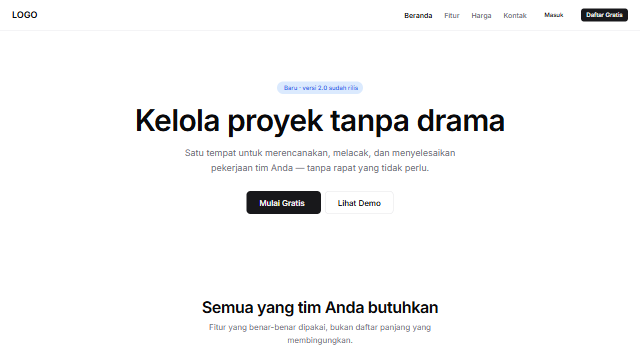 | [Neutral Modern](design-kits/neutral-modern/) | 1.1.0 | Modern | Business, SaaS, Landing Page, Dashboard |
| 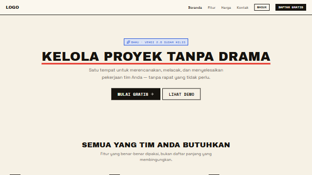 | [Zine](design-kits/zine/) | 1.1.0 | Brutalist | Blog, Portfolio, Personal, Landing Page |
| 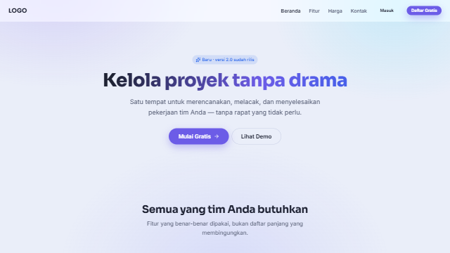 | [Glass](design-kits/glass/) | 1.0.0 | Futuristic | SaaS, Landing Page, Business, Portfolio |
| 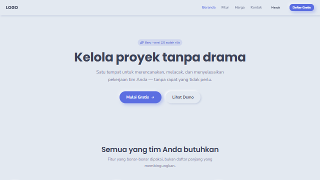 | [Neumorph](design-kits/neumorph/) | 1.0.0 | Minimalist | SaaS, Dashboard, Landing Page, Personal |
| 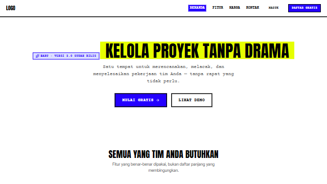 | [Brutal](design-kits/brutal/) | 1.0.0 | Brutalist | Portfolio, Landing Page, Event, Personal |
| 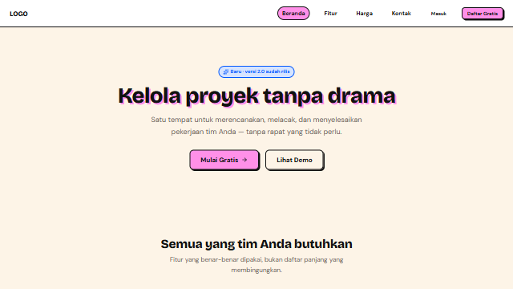 | [Neo Brutal](design-kits/neo-brutal/) | 1.0.0 | Playful | Landing Page, SaaS, E-commerce, Portfolio |
| 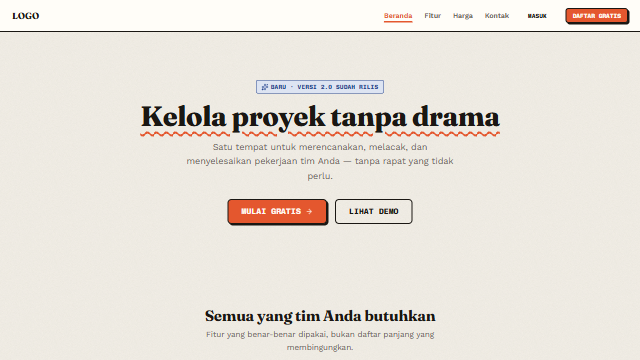 | [Tactile](design-kits/tactile/) | 1.0.0 | Editorial | Portfolio, Blog, Restaurant, Personal |
| 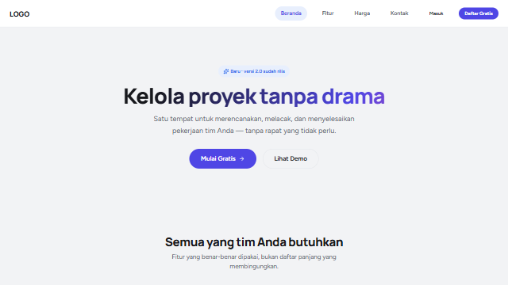 | [Bento](design-kits/bento/) | 1.0.0 | Modern | SaaS, Dashboard, Landing Page, Portfolio |
| 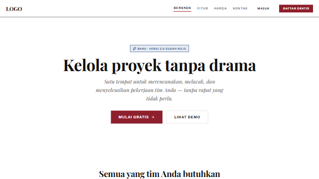 | [Editorial](design-kits/editorial/) | 1.0.0 | Editorial | Blog, Portfolio, Business, Personal |
| 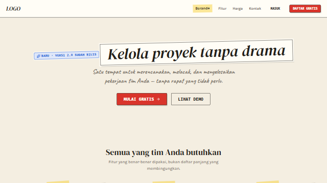 | [Collage](design-kits/collage/) | 1.0.0 | Experimental | Portfolio, Personal, Blog, Event |
| 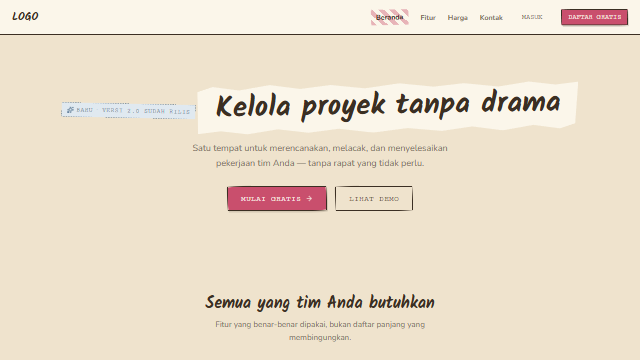 | [Scrapbook](design-kits/scrapbook/) | 1.0.0 | Playful | Personal, Blog, Portfolio, Event |
| 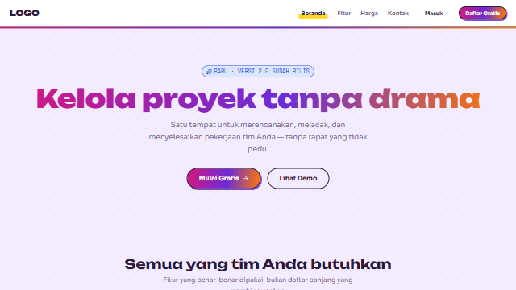 | [Maximal](design-kits/maximal/) | 1.0.0 | Experimental | Landing Page, Event, Portfolio, E-commerce |
| 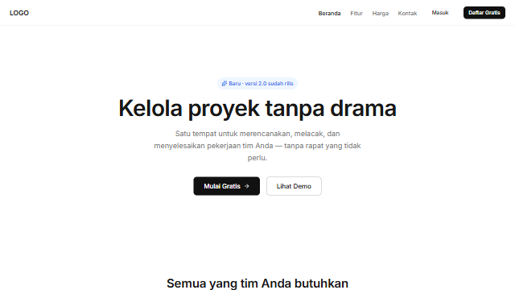 | [Minimal](design-kits/minimal/) | 1.0.0 | Minimalist | SaaS, Business, Portfolio, Landing Page |
| 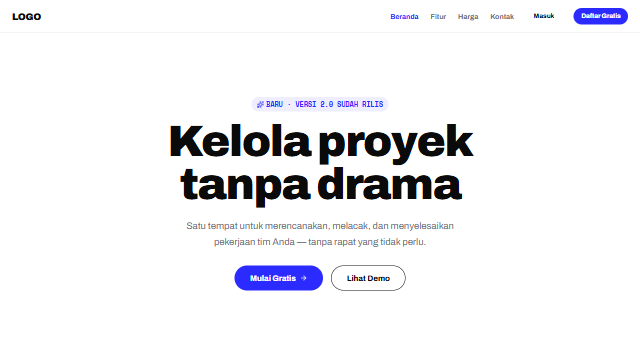 | [Bold Minimal](design-kits/bold-minimal/) | 1.0.0 | Minimalist | SaaS, Business, Portfolio, Landing Page |
| 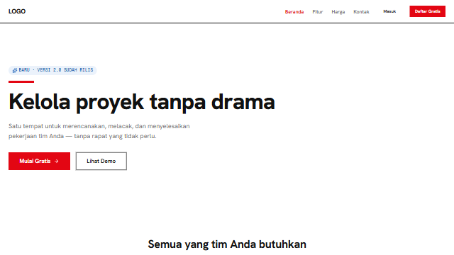 | [Swiss](design-kits/swiss/) | 1.0.0 | Minimalist | Business, SaaS, Portfolio, Education |
| 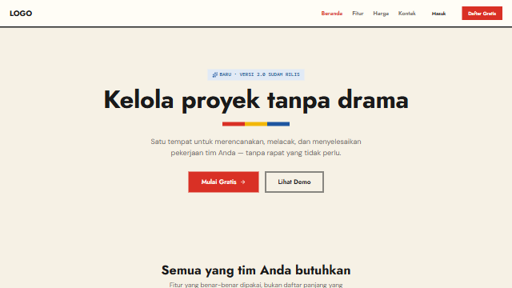 | [Bauhaus](design-kits/bauhaus/) | 1.0.0 | Retro | Portfolio, Event, Education, Landing Page |
| 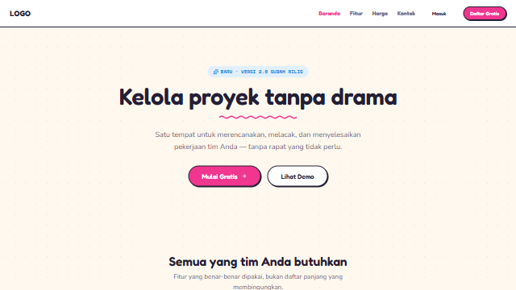 | [Memphis](design-kits/memphis/) | 1.0.0 | Playful | Landing Page, Event, Personal, Portfolio |
| 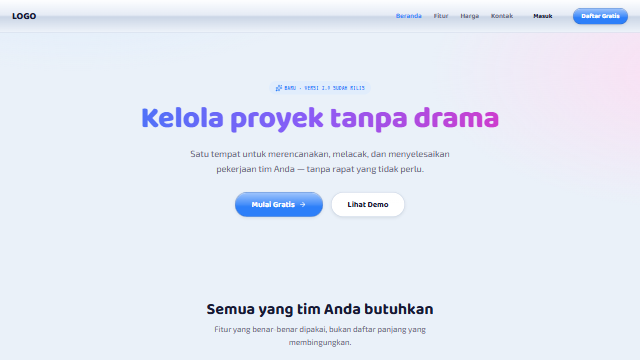 | [Y2K](design-kits/y2k/) | 1.0.0 | Retro | Personal, Portfolio, Landing Page, Blog |
| 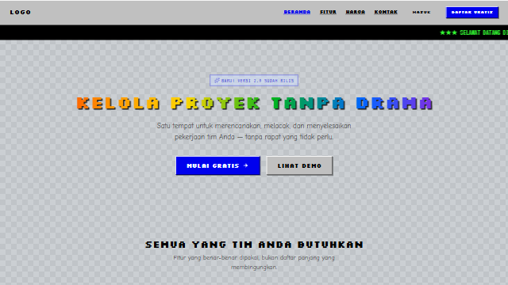 | [Retro Web](design-kits/retro-web/) | 1.0.1 | Retro | Personal, Portfolio, Blog, Landing Page |
| 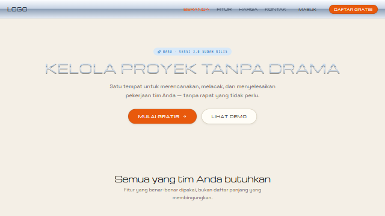 | [Retrofuturism](design-kits/retro-futurism/) | 1.0.1 | Retro | SaaS, Landing Page, Portfolio, Business |
| 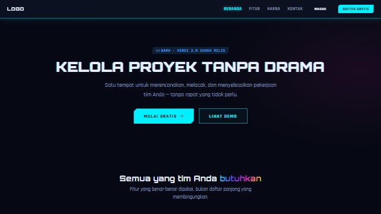 | [Cyberpunk](design-kits/cyberpunk/) | 1.0.1 | Futuristic | SaaS, Dashboard, Landing Page, Portfolio |
| 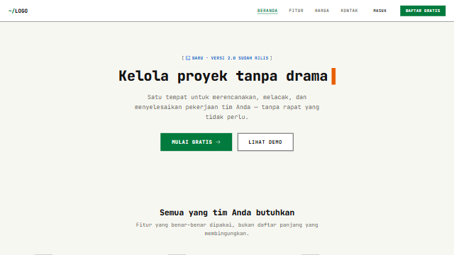 | [Cybercore](design-kits/cybercore/) | 1.0.1 | Experimental | SaaS, Dashboard, Portfolio, Blog |
| 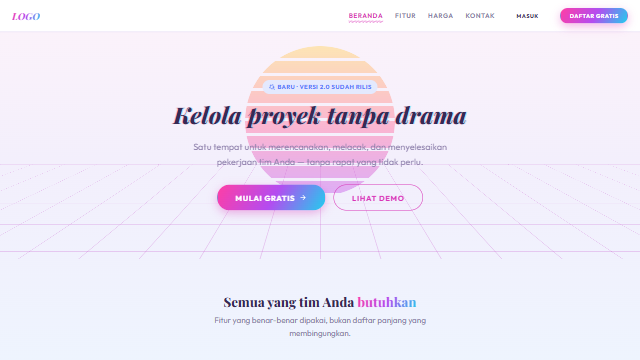 | [Vaporwave](design-kits/vaporwave/) | 1.0.1 | Retro | Portfolio, Landing Page, Personal, Blog |
| 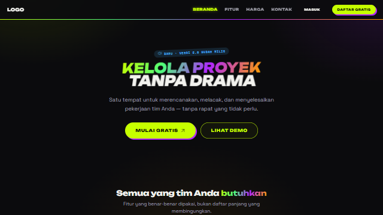 | [Acid Graphics](design-kits/acid-graphics/) | 1.0.0 | Experimental | Portfolio, Landing Page, Personal, SaaS |
| 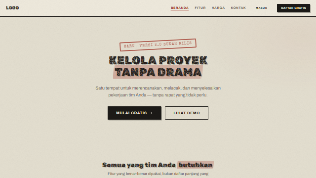 | [Grunge](design-kits/grunge/) | 1.0.0 | Retro | Portfolio, Personal, Blog, Landing Page |
| 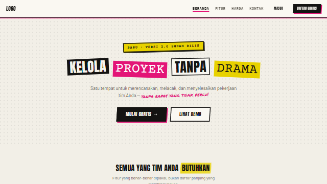 | [Punk](design-kits/punk/) | 1.0.0 | Experimental | Portfolio, Personal, Landing Page, Blog |
| 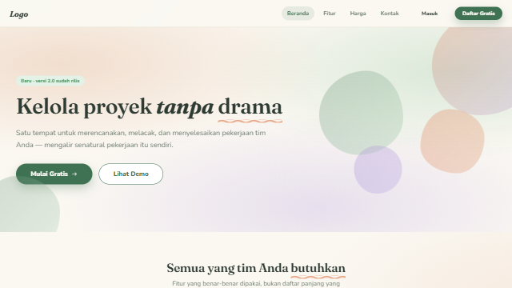 | [Organic](design-kits/organic/) | 1.0.0 | Playful | Landing Page, Health, Portfolio, Personal |
| 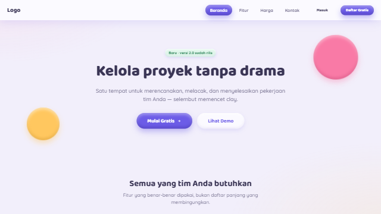 | [Clay](design-kits/clay/) | 1.0.0 | Playful | Landing Page, SaaS, Education, Personal |
| 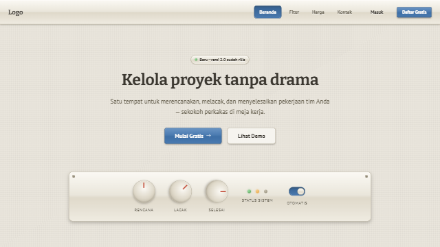 | [Skeuomorph](design-kits/skeuomorph/) | 1.0.0 | Retro | Landing Page, Business, Portfolio, Personal |
| 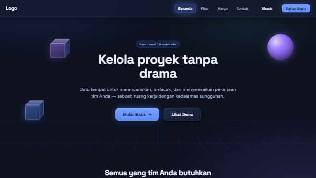 | [Spatial](design-kits/spatial/) | 1.0.0 | Futuristic | Landing Page, SaaS, Portfolio, Business |
| 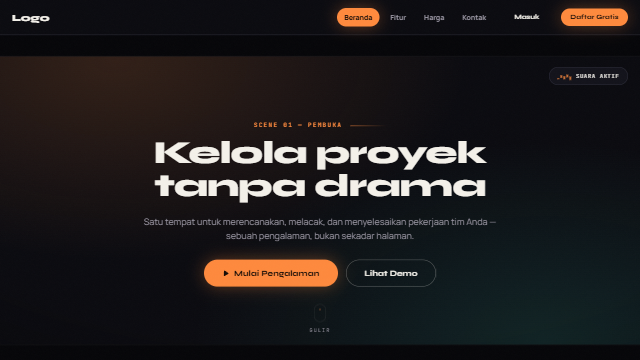 | [Immersive](design-kits/immersive/) | 1.0.0 | Experimental | Landing Page, Portfolio, Event, Personal |
| 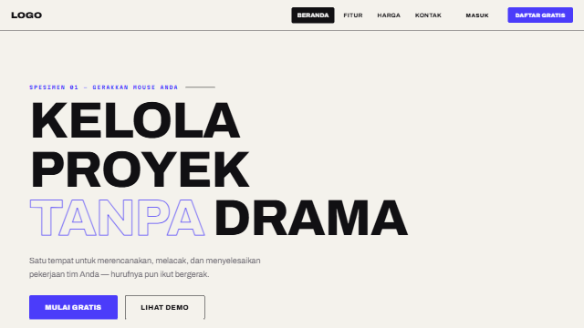 | [Kinetic](design-kits/kinetic/) | 1.0.0 | Experimental | Landing Page, Portfolio, Personal, Event |
| 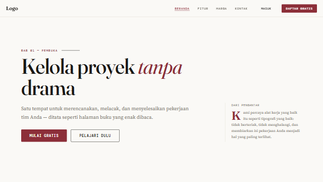 | [Typography First](design-kits/typography-first/) | 1.0.0 | Editorial | Blog, Portfolio, Landing Page, Personal |
| 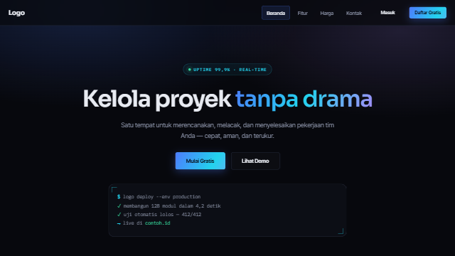 | [Dark Futuristic](design-kits/dark-futuristic/) | 1.0.0 | Dark Mode | SaaS, Landing Page, Dashboard, Business |
| 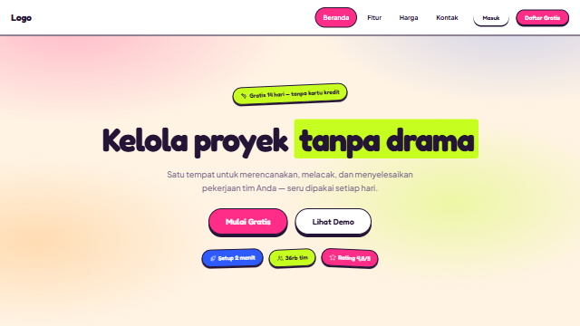 | [Dopamine](design-kits/dopamine/) | 1.0.0 | Colorful | Landing Page, Personal, Event, E-commerce |
| 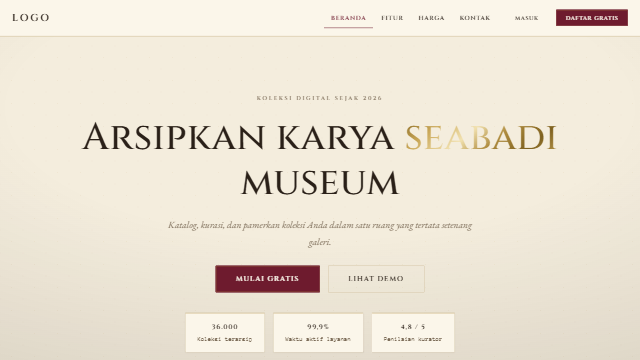 | [Museumcore](design-kits/museumcore/) | 1.0.0 | Luxury | Portfolio, Blog, Education, Personal |
| 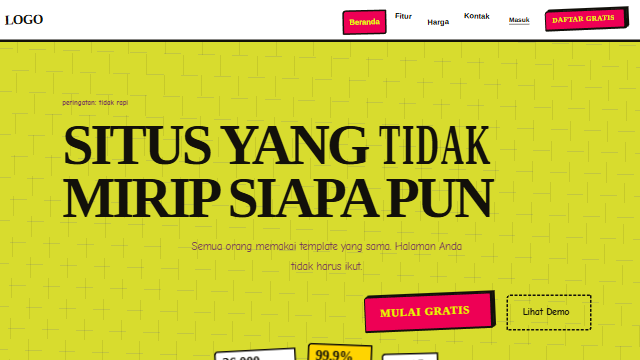 | [Anti-Design](design-kits/anti-design/) | 1.0.0 | Experimental | Portfolio, Personal, Blog, Event |
| 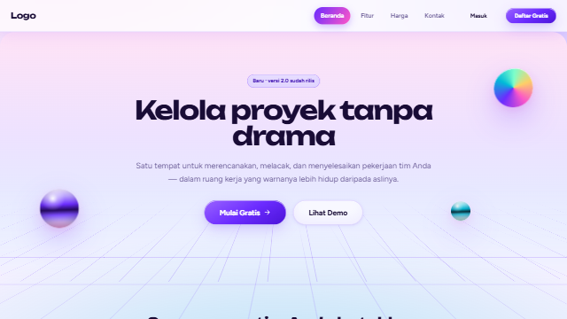 | [Hyperreality](design-kits/hyperreality/) | 1.0.0 | Futuristic | Landing Page, Portfolio, SaaS, Event |
| 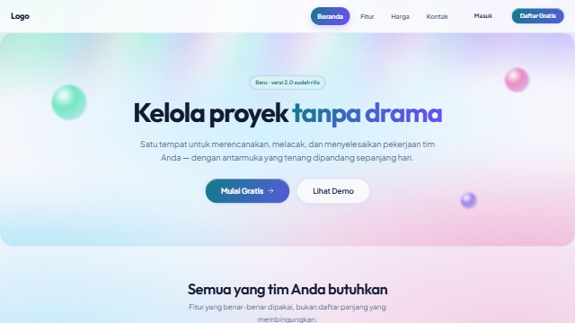 | [Aurora](design-kits/aurora/) | 1.0.0 | Modern | SaaS, Landing Page, Portfolio, Dashboard |
| 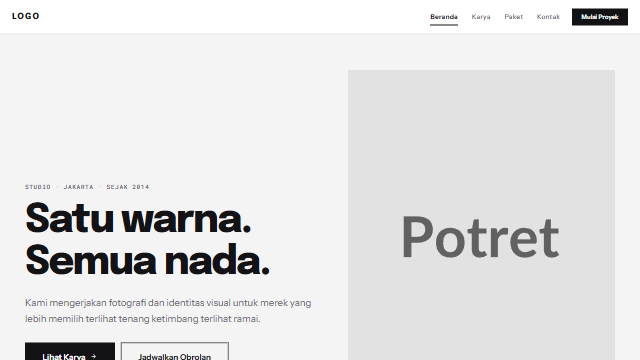 | [Monochrome](design-kits/monochrome/) | 1.0.0 | Luxury | Portfolio, Landing Page, Blog, Personal |
| 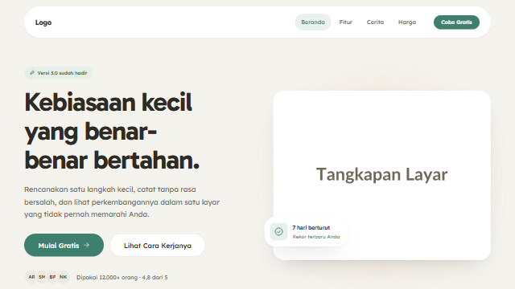 | [Soft UI](design-kits/soft-ui/) | 1.0.0 | Modern | SaaS, Health, Dashboard, Business |
| 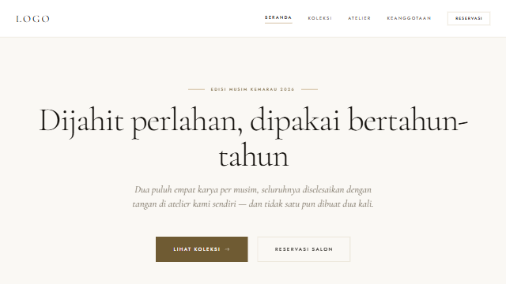 | [Luxury Editorial](design-kits/luxury-editorial/) | 1.0.0 | Luxury | Portfolio, E-commerce, Blog, Real Estate, Restaurant |

Deskripsi `vibe` lengkap tiap kit ada di [`catalog/catalog.json`](catalog/catalog.json).

## Memakai kit

Kit tersedia langsung di dalam **TOKENAI.ID IDE** lewat Katalog Design: pilih kit, dan IDE
mengunduh serta memasangnya ke workspace secara otomatis. Setiap arsip kit menyertakan
`kit.json` dengan field `repository` yang menunjuk kembali ke folder sumbernya di repositori
ini. Unduh IDE-nya di [tokenai.id](https://tokenai.id).

## Lisensi

MIT — lihat [LICENSE](LICENSE). © 2026 PT TOKENAI TEKNOLOGI INDONESIA.
